# Diagrama de Fluxo - Script Conta Estoque

## Fluxo Geral do Processo

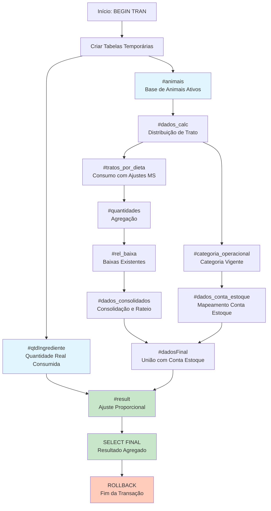

## Fluxo Detalhado por Etapa

### Etapa 1: Base de Dados

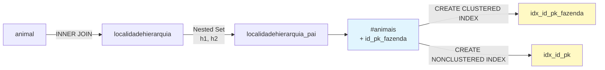

### Etapa 2: Quantidade Real de Ingredientes

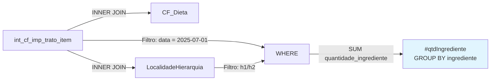

### Etapa 3-4: Distribuição e Categoria

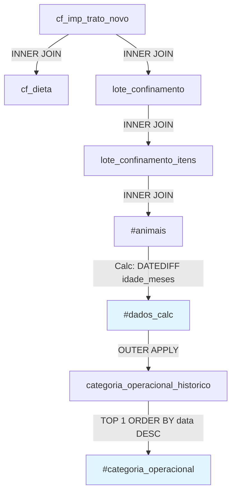

### Etapa 5: Mapeamento para Conta Estoque

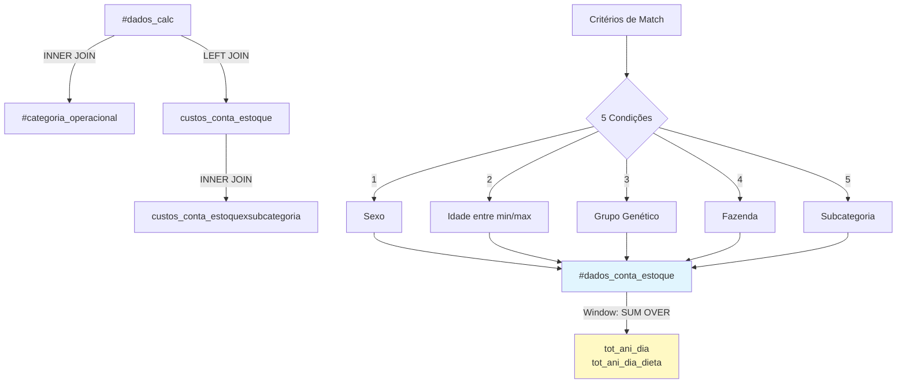

### Etapa 6: Ajustes de Matéria Seca e Custos

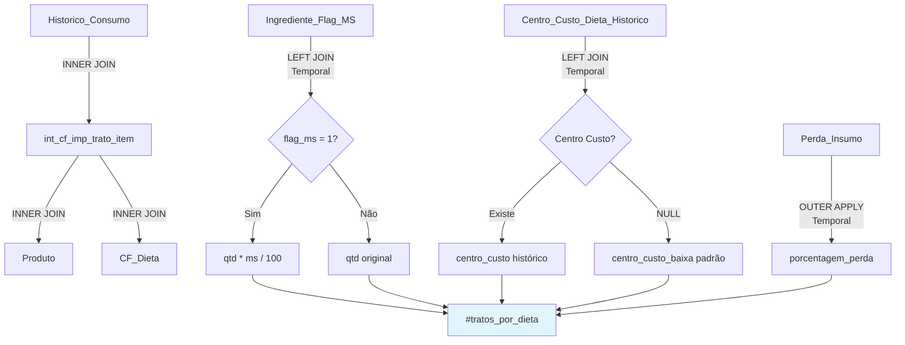

### Etapa 7-9: Consolidação e Rateio

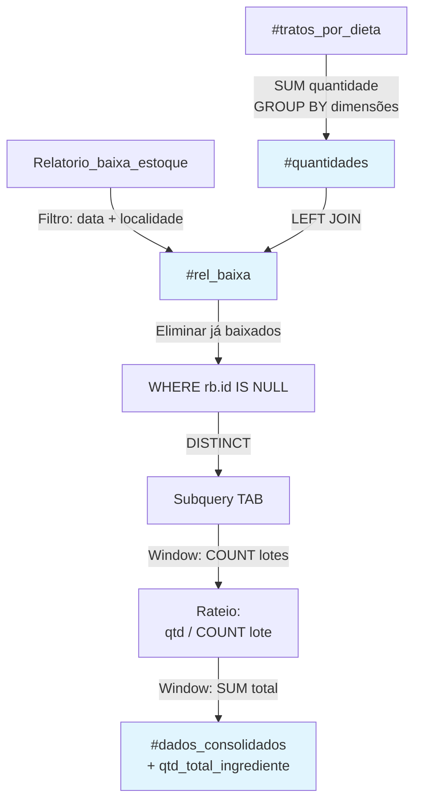

### Etapa 10-12: Finalização e Ajuste

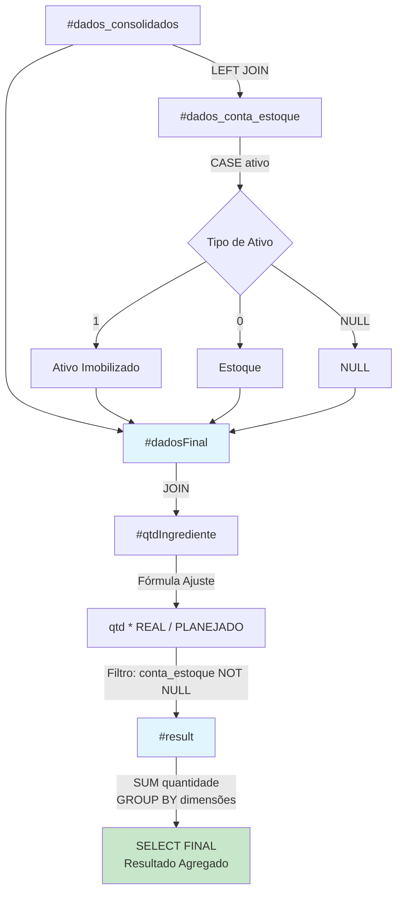

## Fórmulas Chave

### 1. Ajuste de Matéria Seca (MS)
```
SE flag_ms = 1 ENTÃO
    quantidade_ajustada = (quantidade * ms_ingrediente) / 100
SENÃO
    quantidade_ajustada = quantidade
FIM SE
```

### 2. Rateio por Lote
```
quantidade_rateada = quantidade / COUNT(lotes_com_mesma_quantidade)
```

### 3. Ajuste Proporcional Final
```
quantidade_final = quantidade_planejada * (quantidade_real / SUM(quantidade_planejada_total))
```

## Critérios de Mapeamento de Conta Estoque

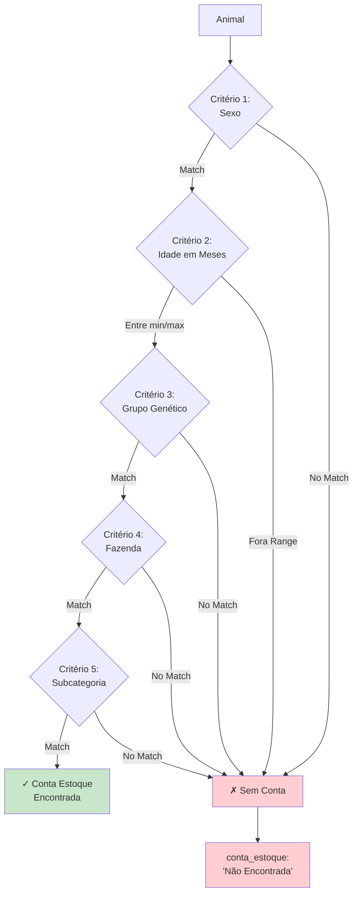

## Timeline de Processamento

```mermaid
gantt
    title Sequência de Execução das Tabelas Temporárias
    dateFormat X
    axisFormat %s
    
    section Base
    #animais           :a1, 0, 1
    #qtdIngrediente    :a2, 0, 1
    
    section Distribuição
    #dados_calc        :b1, after a1, 1
    #categoria_operacional :b2, after b1, 1
    
    section Mapeamento
    #dados_conta_estoque :c1, after b2, 1
    #tratos_por_dieta    :c2, after b1, 2
    
    section Consolidação
    #quantidades       :d1, after c2, 1
    #rel_baixa         :d2, after c2, 1
    #dados_consolidados :d3, after d1, 1
    
    section Finalização
    #dadosFinal        :e1, after d3, 1
    #result            :e2, after e1, 1
    SELECT FINAL       :e3, after e2, 1
```

## Hierarquia de Localidades (Nested Set Model)

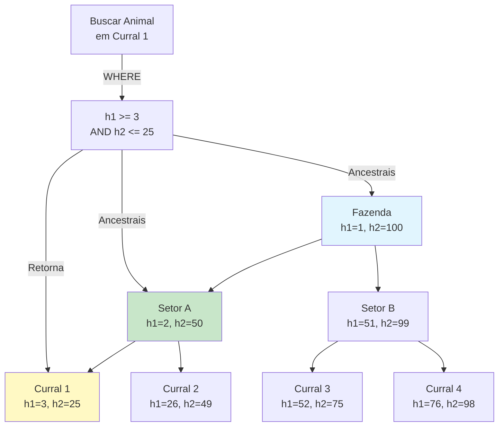

## Estados da Transação

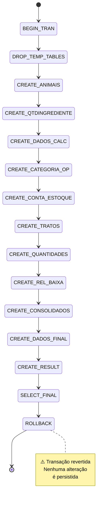

## Dependências entre Tabelas

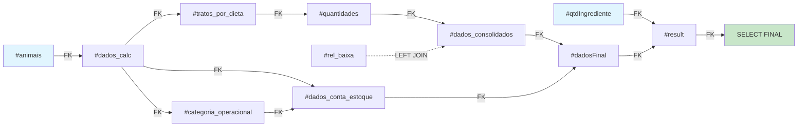

## Legenda

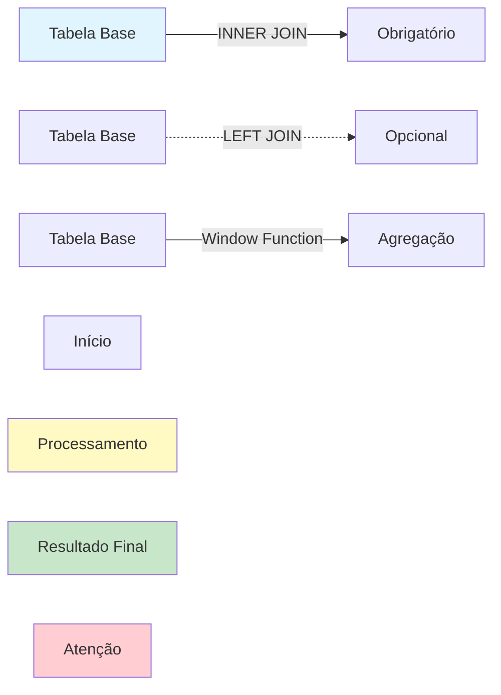
